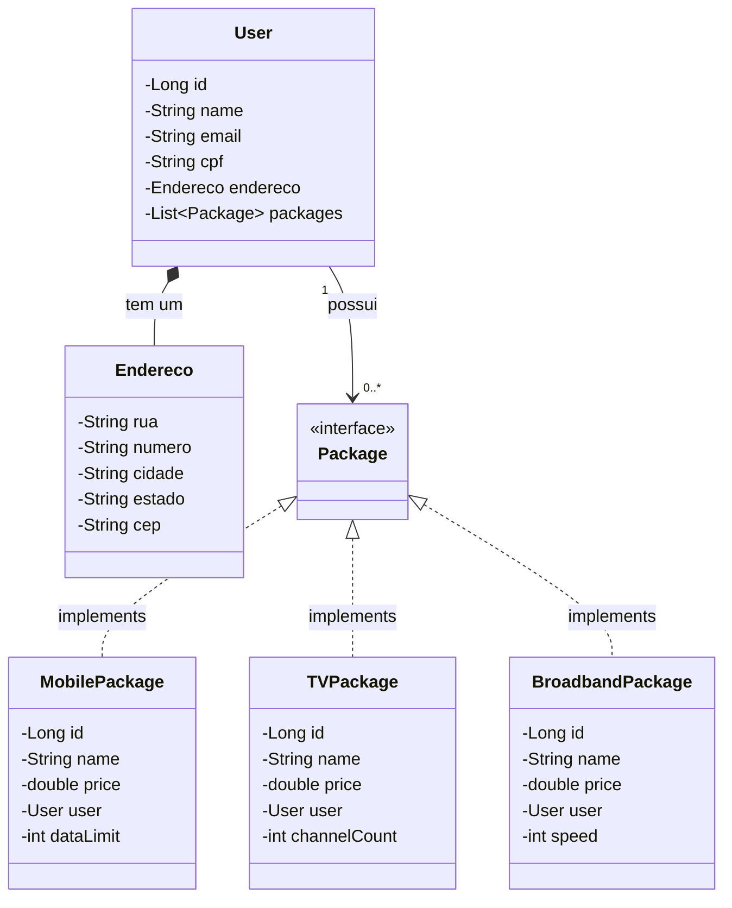

## Desafio de Projeto: 

### Diagrama de Classe:

```mermaid
classDiagram
    class User {
        -Long id
        -String name
        -String email
        -String cpf
        -Endereco endereco
        -List~Package~ packages
    }

    class Endereco {
        -String rua
        -String numero
        -String cidade
        -String estado
        -String cep
    }

    class Package {
        <<interface>>
    }

    class MobilePackage {
        -Long id
        -String name
        -double price
        -User user
        -int dataLimit
    }

    class TVPackage {
        -Long id
        -String name
        -double price
        -User user
        -int channelCount
    }

    class BroadbandPackage {
        -Long id
        -String name
        -double price
        -User user
        -int speed
    }

    User "1" --> "0..*" Package : possui
    User *-- Endereco : tem um
    Package <|.. MobilePackage : implements
    Package <|.. TVPackage : implements
    Package <|.. BroadbandPackage : implements

```