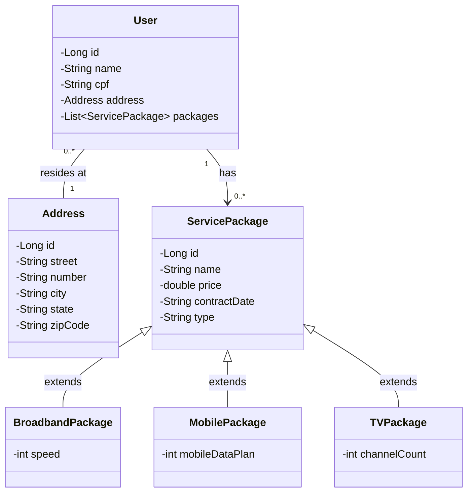

## 🌐 Desafio de Projeto: Portal Multisserviços

### 📜 Descrição:
Este `Desafio de Projeto` foi proposto pela `DIO - Digital Innovation One` inicialmente em `Santander Bootcamp 2023 - Backend Java` e posteriormente no `Bootcamp Claro - Java com Spring Boot`.

Este Projeto tem o objetivo de explorar um domínio de aplicação, mantendo o foco na inovação e desenvolvimento de soluções de qualidade utilizando a linguagem `Java`. Neste projeto foi escolhido o domínio de serviços de telecomunicações semelhantes aos prestados pela Claro. 

É implementado um sistema para cadastrar os clientes e os pacotes que deseja contratar. Dentre os pacotes, temos nesta aplicação disponíveis, pacote de banda larga, plano móvel e tv por assinatura. Mais de um usuário pode residir no mesmo endereço e o sistema verifica se existe pacote de banda larga ou tv por assinatura no endereço em comum impedindo que outros usuários na mesma casa contratem um serviço que já possui e ao mesmo tempo permite que cada um tenha seu plano móvel idividual.


### 📊 Diagrama de Classe:




### ⏯ Como utilizar:

**Pré-requisitos**
- Java 17
- Gradle (usado para build e gerenciamento de dependências)

**Rodar o projeto**
#### Usando gradle:

Para iniciar a aplicação com Gradle, execute o seguinte comando:
```bash
./gradlew bootRun
```
Ou rode a aplicação pela classe principal que contém o método `main()`:
```bash
./gradlew run --args='me.dio.desafio_de_projeto_portal_multisservicos.DesafioDeProjetoPortalMultisservicosApplication.java'
```
Se estiver utilizando uma IDE como `ItelliJ` ou `Eclipse` pode executar a classe diretamente, localizada em:
```bash
src/main/java/me/dio/desafio_de_projeto_portal_multisservicos/DesafioDeProjetoPortalMultisservicosApplication.java
```

**Testar os endpoints**

Depois de rodar a aplicação, você pode acessar o `Swagger` para testar os `endpoints`:
- URL do Swagger: http://localhost:8080/swagger-ui.html

**Acessar o banco de dados H2**

Para verificar os dados persistidos, acesse o console do H2:
- URL do H2: http://localhost:8080/h2-console
- Credenciais: 
  - url: jdbc:h2:mem:bootcamp-claro
  - username: claro2024
  - password:


### 🛠 Tecnologias utilizadas:
<div>
    
    
    
    
    
</div>


### 📫 Entre em contato comigo:
<div>
  <a href="https://www.linkedin.com/in/sidneysperandio" target="_blank"></a>   
  <a href = "mailto:dev.ssperandio@gmail.com"></a>
  <a href="https://wa.me/5511975018322" target="_blank"></a>
</div>


### 🤝 Contribua:
Sinta-se a vontade para somar com a sua contribuição, basta dar um `fork`.

⭐️ Dê um `star` no projeto.

🐛 Abra uma `issues` para relatar algum problema.


